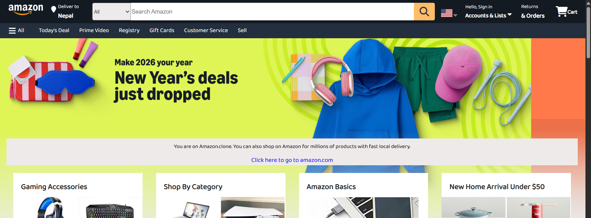

# E-Commerce Website Clone

A clone of e-commerce website clone inspired by Amazon, built with HTML, CSS, and JavaScript. This project demonstrates modern web development techniques for creating an online shopping platform with interactive features.The page is created for big screens i.e, laptops, PCs only.

## Screenshots

## Features

- **Interactive UI**: Smooth animations, hover effects, and dynamic elements
- **Search Functionality**: Real-time search with overlay and messaging
- **Navigation**: Sidebar menu, dropdowns, and intuitive navigation
- **Product Sliders**: Horizontal scrolling product galleries

## Technologies Used

- HTML5
- CSS3 (Animations)
- JavaScript

## Live Demo

View the live demo: [https://ujjwalnepal11.github.io/e-commerce/]
